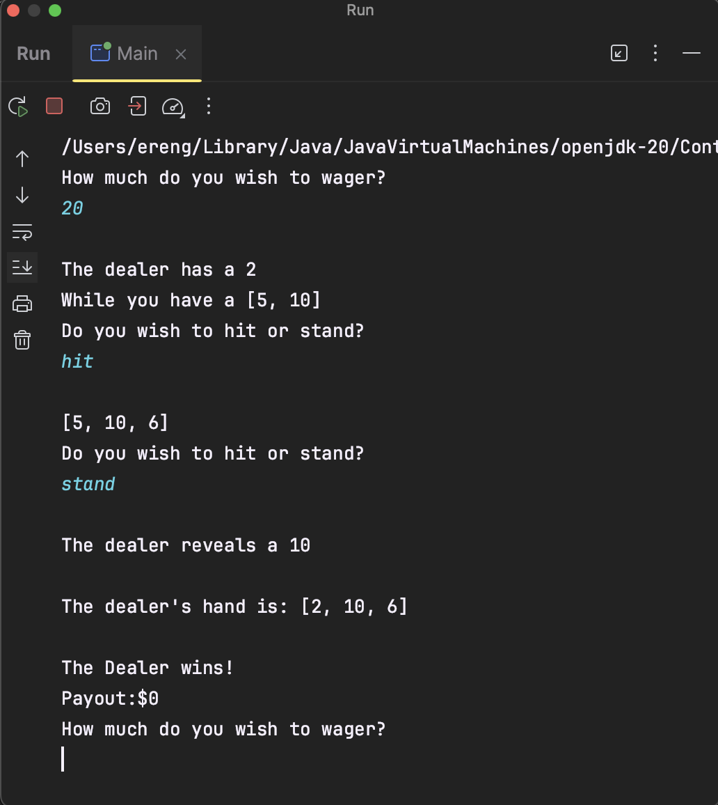

# Blackjack

Practice coding in Java for KdG

### Game

The program is a simple game of blackjack. The rules are simple, you hit or stand and the dealer deals you according to your choice.

### To-Do
```
Add database connection to see wins and losses (PostgreSQL)
~~Add option to play game automatically and get statistics~~
Rework some of the code to make it more readable and more object oriented
Add more comments

Add GUI (later)
```

### How the game works

1. The player is asked how much they want to wager
2. The game starts and reveals the player's and dealer's cards.
3. The player has the option to hit or stand.
4. After the player is ready to stand, the dealer plays and draws till 17.
5. Winner is calculated depending on the higher value hand or if a bust occured.


### Screenshot

