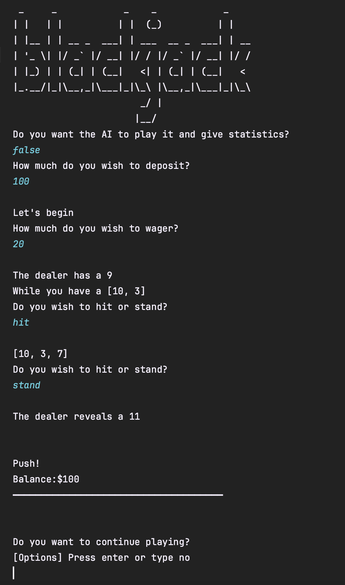

# Blackjack

Practice coding in Java for KdG

### Game

The program is a simple game of blackjack. The rules are simple, you hit or stand and the dealer deals you according to your choice.

### To-Do
```
Add database connection to see wins and losses (PostgreSQL)
Add option to play game automatically and get statistics
Add GUI (hard)
```

